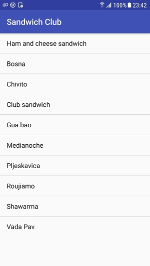
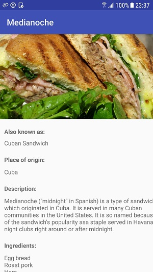

# Sandwich Club Project 

## Project Overview

In this project,  **Sandwich Club** app to
shows the details of each sandwich once it is selected.

## What is demonstrated?
Through this project, I will:

- Practice JSON parsing to a model object
- Design an activity layout
- Populate all fields in the layout accordingly
- Design the layout for the detail activity so the different elements
display in a sensible way. Implement the JSON parsing in JsonUtils so it
produces a Sandwich Object that can be used to populate the UI that I designed.

